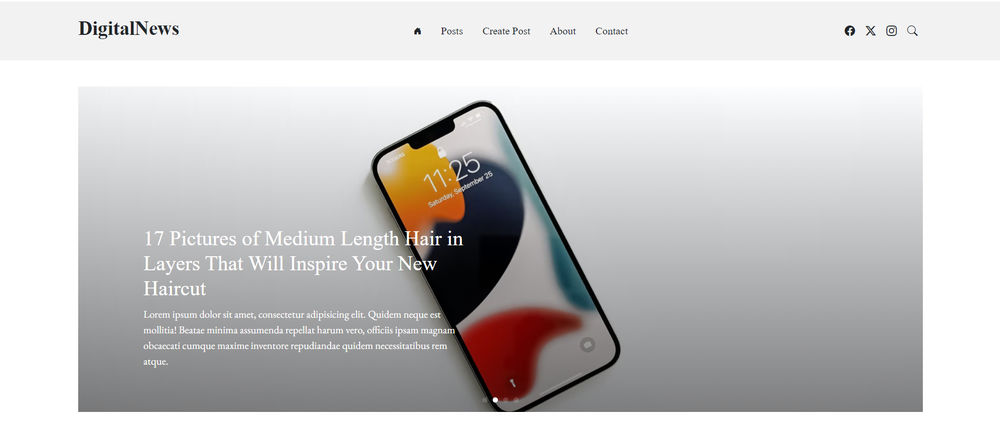

Building a Digital News App: A Step-by-Step Guide
Introduction:
Welcome to my Digital News App project! In this journey, we'll use Next.js, React, MongoDB, and Bootstrap to create a modern web application for managing digital news content. Our focus will be on making the process simple and enjoyable, even if you're new to web development.
Part 1: Getting Started
In this part, we'll set up everything we need for our project. Think of it as preparing the canvas and paints before we start painting our masterpiece!
Part 2: Creating News Stories with REST API
Next, we'll dive into the core of our app: the ability to add, view, edit, and delete news stories. We'll use REST API endpoints to make it happen.
Part 3: Crafting the Frontend with Next.js and React
Now it's time to build the part of our app that users will interact with. We'll use Next.js and React to create a beautiful and intuitive interface for reading and managing news articles.
Part 4: Connecting to MongoDB
Behind the scenes, we need a place to store all our news data. That's where MongoDB comes in. We'll connect our app to MongoDB so it can store and retrieve news stories seamlessly.
Part 5: Styling Made Simple with Bootstrap
Lastly, we'll make our app look good without spending hours on CSS. With Bootstrap, we can easily apply pre-made styles and components to give our app a professional look.
Conclusion:
By the end of this project, we will build a fully functional Digital News App from scratch. Let's get started!
